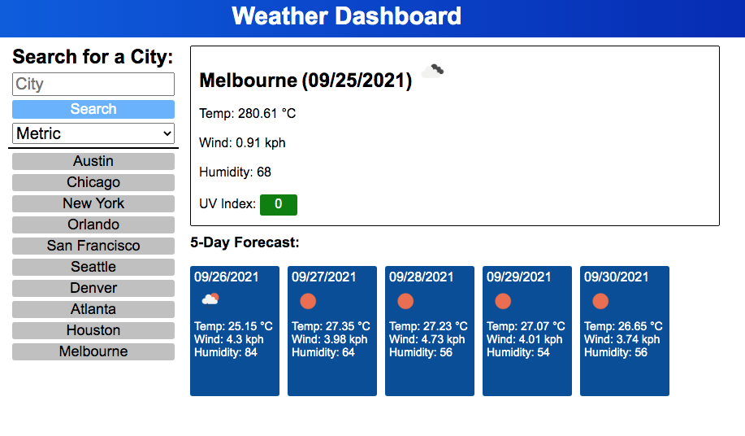

# Weather-Dashboard
Homework Week 6

We were tasked with retrieving data from tht Third-party API, Open Weather Map, using it in the context of our own. The challenge was to build a weather dashboard that will run in the browser and feature dynamically updated HTML and CSS.

